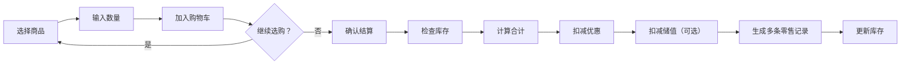

# 商品零售购物车模式改造方案 V2.15.5

## 一、现状分析

### 当前局限
当前商品零售 (`ProductSaleFrame`) 是**单次单商品**模式：
- 每次只能选 1 种商品 → 输入数量 → 成交
- 没有购物车概念，无法一次购买多种商品
- 没有优惠金额功能
- 不支持使用会员储值余额支付

### 当前数据流
```
product_sale Sheet（11列）
零售编号 | 零售日期 | 会员编号 | 会员姓名 | 商品名称 | 数量 | 单价 | 总价 | 支付方式 | 操作员 | 备注
```

### 现有资源可用
- **商品管理** (`product` Sheet) — 含库存数量、零售价
- **会员信息** (`member` Sheet) — 含会员编号、姓名
- **充值记录** (`recharge` Sheet) — 含储值余额（可查会员最新余额）
- **商品零售** (`product_sale` Sheet) — 成交记录存储

## 二、改造目标

1. **购物车模式**：选择多种商品加入购物车，统一结算
2. **优惠金额**：成交前可设置优惠金额（立减）
3. **储值支付**：会员可选择用储值余额支付

## 三、详细方案

### 3.1 界面布局改造

将原"快速零售"区域改造为三栏布局：

```
┌─────────────────────────────────────────────────────────┐
│ 🛒 商品零售                                              │
├──────────────┬──────────────────┬────────────────────────┤
│ ① 商品选择区   │ ② 购物车列表        │ ③ 结算区              │
│              │                  │                        │
│ 商品下拉框     │ 表格：             │ 会员选择               │
│ 数量输入       │ 商品名 | 数量      │ 合计金额：¥XXX        │
│ 单价显示       │ 单价 | 小计       │ 优惠金额：[输入]       │
│ [加入购物车]   │ [删除] [清空]      │ 应付金额：¥XXX        │
│              │                  │ 支付方式：[下拉]        │
│              │                  │ ☑ 使用储值(余额:¥XX)   │
│              │                  │ [💵 确认结算]           │
├──────────────┴──────────────────┴────────────────────────┤
│ 📋 零售记录表格                                           │
│ ...                                                      │
└──────────────────────────────────────────────────────────┘
```

### 3.2 购物车逻辑



**购物车数据结构**（内存）：
```python
self.cart = []  # [{商品名, 商品编号, 数量, 单价, 小计, 库存剩余}, ...]
```

### 3.3 新增/修改字段

**`product_sale` Sheet 新增 2 列**（不破坏现有数据，加在新位置）：

| 新增列 | 说明 | 类型 | 默认值 |
|--------|------|------|--------|
| `优惠金额` | 该笔记录分摊的优惠金额 | 数字 | 0 |
| `使用储值` | 是否使用储值余额 | 文本(是/否) | 否 |

### 3.4 结算流程

```
① 用户点击 [确认结算]
    ↓
② 校验购物车不为空
    ↓
③ 校验所有商品库存充足
    ↓
④ 计算: 合计金额 = ∑(单价 × 数量)
        应付金额 = 合计金额 - 优惠金额
    ↓
⑤ 如果勾选"使用储值":
   查询会员最新储值余额 (从recharge表取最大值)
   如果余额足够 → 该笔扣储值余额
   如果余额不足 → 提示充值
    ↓
⑥ 生成零售记录 (购物车中每种商品一条记录，总价=该商品小计)
   每条记录写入 product_sale Sheet
    ↓
⑦ 更新库存 (每种商品扣减对应数量)
    ↓
⑧ 如果使用储值:
   在 recharge Sheet 追加一条扣减记录 (负值)
   更新会员最新储值余额
    ↓
⑨ 清空购物车，刷新页面
```

### 3.5 优惠金额规则

- 优惠金额 ≤ 合计金额（不能倒贴）
- 优惠金额输入时实时校验
- 优惠分摊方式：**不分摊到单品**，每条记录的优惠金额字段填单品的占比
  - 例如：商品A ¥100 + 商品B ¥200，优惠¥30
  - 商品A优惠 = 30 × (100/300) = ¥10
  - 商品B优惠 = 30 × (200/300) = ¥20

### 3.6 储值余额查询

从 `recharge` Sheet 获取该会员最新的 `储值余额` 字段：
```python
def get_member_balance(self, member_id):
    """获取会员最新储值余额"""
    recharges = self.get_all_recharges()
    member_records = [r for r in recharges if r.get("会员编号") == member_id]
    if not member_records:
        return 0
    # 取最近一条记录的余额
    latest = max(member_records, key=lambda r: r.get("_row", 0))
    return float(latest.get("储值余额", 0) or 0)
```

## 四、改动文件清单

| 文件 | 操作 | 说明 |
|------|:----:|------|
| `gui/product_sale_frame.py` | **重写** | 购物车模式完整重构（约500行） |
| `core/product_mixin.py` | 修改 | 新增 `get_member_balance()`, `add_stored_value_deduction()` |
| `config.py` | 修改 | 版本号 v2.15.4 → v2.15.5 |
| `docs/商品零售购物车模式方案_V2.15.5.md` | 新增 | 本文档 |

## 五、不做的事情

- ❌ 不改动已存在的零售记录数据格式
- ❌ 不涉及 POS 打印机/小票功能
- ❌ 不改动 `product` Sheet 结构
- ❌ 不改动会员信息表
- ❌ 不新增独立 Sheet（新增列在已有 Sheet 末尾）

---

**版本**: V2.15.5  
**状态**: ✅ 已完成  
**预计工作量**: 1-2 小时
